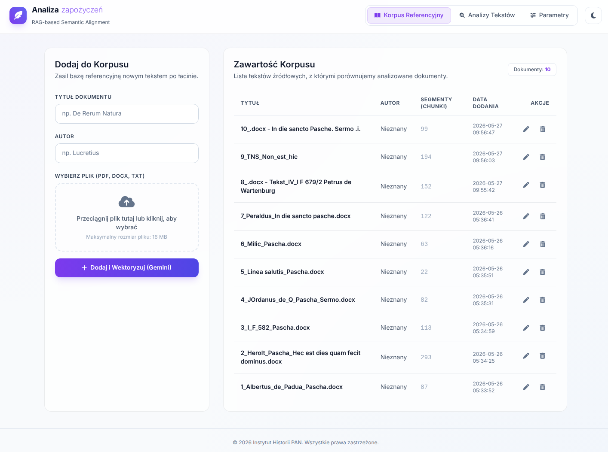
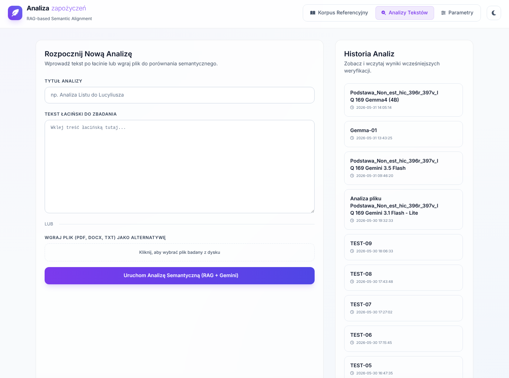
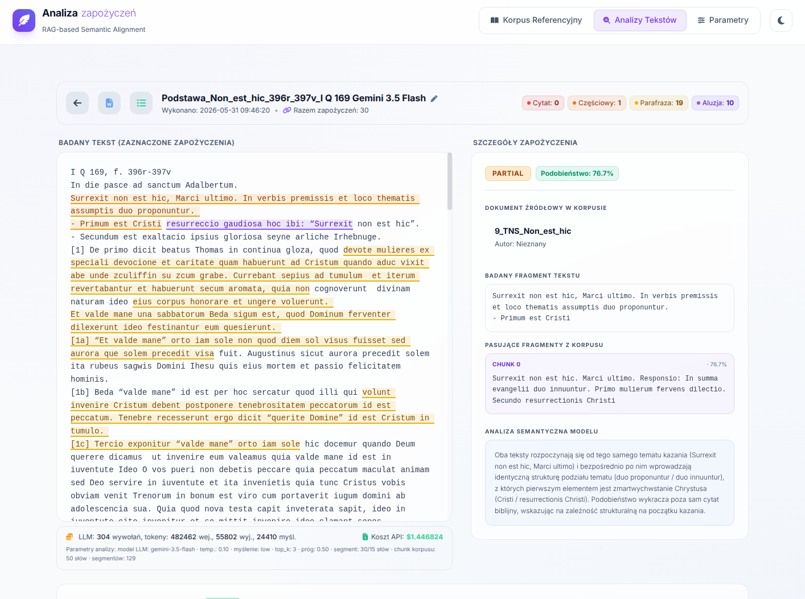
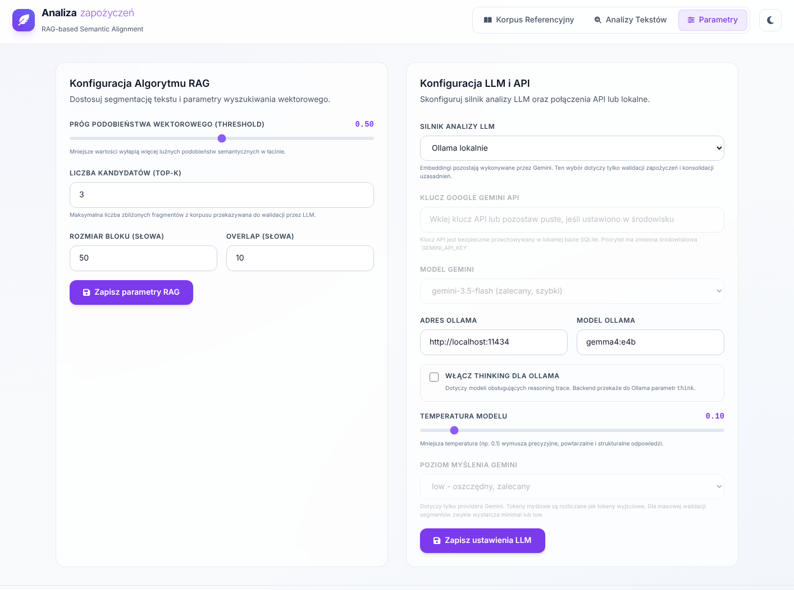

# Analiza zapożyczeń

Aplikacja webowa przeznaczony do wyszukiwania i analizy zapożyczeń (cytaty, częściowe cytaty, parafrazy i aluzje) w łacińskich manuskryptach średniowiecznych, za pomocą badania semantycznego podobieństwa fragmentów tekstu (baza wektorowa ChromaDb) oraz analizie przeprowadzanej przez duże modele językowe (Gemini, Gemma). Umożliwia przygotowanie korpusu tekstów referencyjnych a następnie analizę dostarczonych przez użytkownika tekstów, pod kątem zapożyczeń z dokumentów z korpusu. 

Aplikacja zainspirowana programem Scripture Detector (https://github.com/yale-ch/scripture-detector).

Technologia:
  Python, Flask, Sqlite, ChromaDb, LLM

Struktura folderów:

- analiza-zapozyczen
    - chroma_db
    - doc
    - instance
    - static
    - templates
    - uploads
    
## Zrzuty ekranu

Korpus tesktów referencyjnych:

Lista analiz:

Wynik analizy:

Parametry aplikacji:

